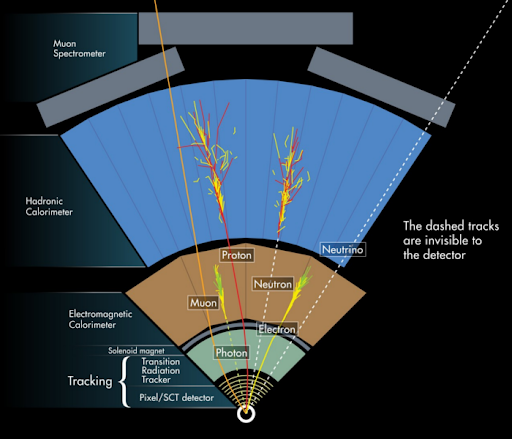

---
---

*Imagen extraída del siguiente [link](http://collider.physics.ox.ac.uk/detecting.html)*
# **Física de altas energías**

 La física de altas energías o física de partículas estudia las propiedades y componentes fundamentales de materia y antimateria, como también las interacciones entre partículas. Según el modelo estandar de Física de partículas son establecidos 6 leptones (electrón, neutrino-electrónico, muon, neutrino-muónico, tau y neutrino-tauónico) y 6 quarks (arriba, abajo, encanto, extraño, cima y fondo) como partículas fundamentales de la materia que conocemos. Adicionalmente el modelo describe 5 bosones que son los intermediadores de la fuerza fuerte, débil y electromagnética de las cuatro fuerzas fundamentales de la naturaleza. Existen aún muchas interrogantes y discrepancias con el modelo estándar, como por ejemplo, la oscilación de neutrinos o asimetría entre materia-antimateria. Para responder estas y otras interrogantes se ha utilizado la colisión de partículas en diferentes aceleradores de partículas construidos alrededor del mundo. 

 Actualmente el gran colisionador de hadrones (LHC) está en proceso de renovación e instalación de nuevos detectores. Como parte de la renovación en el experimento ALICE (A Large Ion Collider Experiment) están siendo instalados detectores de silicio llamado ALPIDE (del Ingles <i>ALice PIxel DEtector</i>) que está diseñado en base la tecnología CMOS towerJazz 180 nm. La simulación y caracterización de estos detectores es primordial para la instalación y operación de los experimentos de Física de partículas. Para la simulación es esencial el diseño geométrico de los componentes del detector de acuerdo a las respectivas propiedades físicas y la caracterización de detectores consiste en hacer pruebas de funcionamiento variando condiciones  de temperatura, alimentación y radiación para encontrar óptimas 	condiciones de trabajo, como la mejor relación señal/ruido y menor potencia de consumo del detector. El grupo de altas energías de la Pontificia Universidad Católica de Perú como parte de la colaboración del experimento ALICE, en la etapa de doctorando asignó a Carlos Soncco la caracterización del sensor ALPIDE-2 y la implementación geométrica  para la simulación del <i> Muon Forward Tracker </i> en el nuevo sistema de adquisición de datos del experimento ALICE. 
