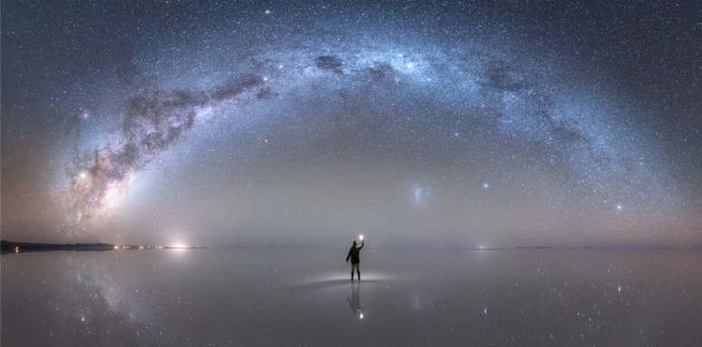

---
---

 <i> Imagen de nuestra Galaxia tomada por el astrofotografo peruano Jheison Huerta </i> <a href="https://www.bbc.com/portuguese/internacional-50274440"> link </a>  
# **Astronomía y Astrofísica**

 En la actualidad los términos astronomía y astrofísica son usados indistintamente para referirse al estudio de cuerpos celestes más allá de la atmósfera terrestre. Sin embargo, inicialmente la astronomía estaba relacionada al estudio del movimiento de cuerpos celestes y la astrofísica surgió como una rama de la astronomía para estudiar las propiedades físicas de esos objetos. Dependiendo del tipo de objeto en estudio surgieron otras ramas de la astronomía, como por ejemplo, el área de estudio relacionado a los planetas fue denominado ciencias planetarias, el área relacionado al estudio de estrellas fue denominado astrofísica estelar, el área relacionado al estudio de las galaxias fue denominado astrofísica galáctica, etc. Además de esas ramas, la astronomía también puede ser clasificada de acuerdo a los intervalos de longitud de onda del espectro electromagnético. Por lo tanto, según esta clasificación tenemos la astronomía en el visible, astronomía en el infrarrojo,  astronomía en radio, etc. Con el avance de la tecnología, la construcción de modernos telescopios y el descubrimiento de exoplanetas recientemente surgió el área de la astrobiología. 

 Por lo mencionado, en la actualidad los astrónomos investigan en una de estas ramas específicas y obtienen la información proveniente de los objetos por medio del uso de detectores colocados en telescopios a través de diferentes técnicas como la fotometría, espectroscopía, entre otras. 

Las áreas específicas en los que algunos miembros del grupo Cusco Científico vienen trabajando actualmente son descritos a continuación:

1. 
 Espectroscopia estelar (Astronomía estelar) a cargo de Verónica Loaiza Tacuri. Durante la maestría su proyecto de investigación consistió en el estudio de abundancias químicas de estrellas gigantes rojas pertenecientes a aglomerados abiertos utilizando espectros en el infrarrojo cercano obtenidos por el <i>survey</i> espectroscópico APOGEE. Actualmente, su proyecto de investigación de doctorado consiste en el estudio de abundancias químicas de estrellas del tipo espectral FGK que poseen planetas. Para realizar esta investigación son utilizados espectros en el visible.

2. 
 Dinámica de la Galaxia (Astrofísica galáctica) a cargo de Fredi Quispe Huaynasi. Su trabajo de investigación está enfocado en la búsqueda de estrellas de hipervelocidad en catálogos estelares, caracterización espectroscópica y fotométrica e integración de órbitas con el fin de estudiar la dinámica y determinar el origen de estas estrellas.
 

3. 
 Estudio de nubes moleculares a través de espectros obtenidos en radio (Astroquímica) a cargo de Elluz Pacheco Cabrera. Su investigación se centra en la nube molecular  W51IRS1. Los datos son obtenidos con el radiotelescopio de Arecibo, uno de los telescopios más grandes del  mundo, en el rango centimétrico mediante la técnica de  <i>Double Position Switched.</i> El objetivo de la investigación consiste en realizar un inventario de las líneas moleculares, encontrar nuevas líneas prebióticas y estudiar las condiciones físicas y químicas de la región W51 IRS1. 

