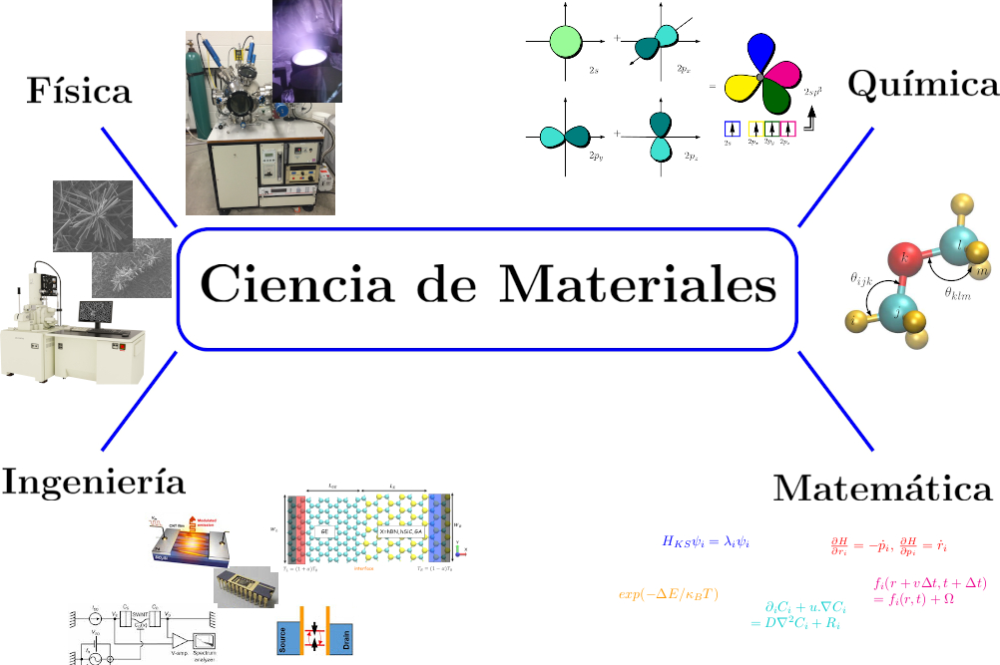

---
---

<!--*Imagen extraída del siguiente [link](https://www.bbc.com/portuguese/internacional-50274440)*-->
# **Ciencia de materiales**

 La ciencia de Materiales es un área multidisciplinaria que estudia las propiedades de los materiales con el fin de implementar una aplicación específica en diversos campos de la ciencia y la ingeniería. Este campo de investigación científica incluye a Físicos, Químicos e Ingenieros que estudian cómo las diversas combinaciones de moléculas y materiales bajo diferentes técnicas físico-químicas dan como resultado diferentes propiedades novedosas, donde fundamentalmente se investiga la relación entre la estructura de los materiales a escala atómica o molecular y las propiedades macroscópicas de ellos. Además, esta ciencia abarca varias clases de materiales que puede constituir un área por separado, donde una manera de clasificar a los materiales es por el tipo de enlace que presentan los átomos como: metales, semiconductores, cerámicos, entre otros. En estos últimos años, una importante atención por parte de la comunidad científica está centrada en la nanociencia y nanotecnología, donde se utiliza el conocimiento de métodos experimentales y computacionales para sintetizar y diseñar nuevos materiales con propiedades especiales. 

Asimismo, algunos integrantes del grupo "cusco científico" vienen investigando diversos temas en esta área como por ejemplo:

1. 
 La fabricación de prototipos de sensores químicos amperométricos sensibles y selectivos para la detección y monitoreo de gases contaminantes como el CH4, NH3 y NO2 basados en Ftalocianinas metálicas modificadas, que se caracteriza por una alta simetría, planaridad y deslocalización de electrones. Este proyecto está siendo desarrollado por la MSc. Soraya I. Flores C. 

 
2. 
 La fabricación y caracterización de películas delgadas de materiales biocerámicos y multicapas magnéticas mediante la técnica  <i>magnetron sputtering</i>. Este proyecto es desarrollado por la MSc. Milida Z. Pinto V.

   
3. 
 El estudio de las propiedades físicas y de transporte (bajo diversas influencias como dopaje, temperatura, tamaño, sustrato, entre otras) de varios nanomateriales tipo 2D y 1D mediante métodos computacionales. Diversos proyectos de este tipo vienen siendo desarrollados por el Dr. Gustavo Cuba Supanta.

