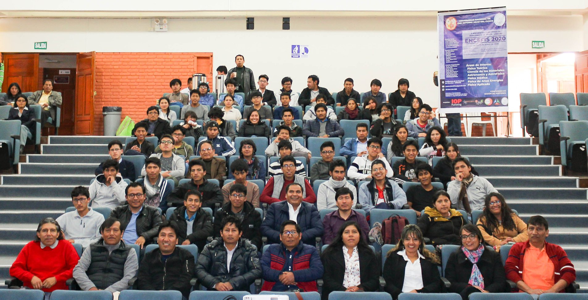

El II Encuentro Científico de Exalumnos de Física UNSAAC, se llevó a cabo en el Auditorio de Pabellón de Ciencias (pabellón C) de la Universidad Nacional de San Antonio Abad del Cusco los días 8, 9 y 10 de enero del 2020. Dicho evento contó con la participación de 3 charlas magistrales, 21 charlas orales, 9 posters presentados y 95 asistentes entre profesionales, estudiantes de física y público en general. Los tópicos de las ponencias correspondieron a las áreas de Física Teórica, Geofísica, Ciencia de Materiales, Física Médica, Física de Altas Energías, Astronomía y Astrofísica. Los ponentes invitados, fueron exalumnos que vienen desarrollando sus estudios y trabajos de investigación en países como Brasil, Puerto Rico, Chile y Perú. Asimismo, hubo participación de 2 estudiantes de la Universidad Nacional Mayor de San Marcos. Para saber más ingrese al siguiente [enlace](encefis_2.md)

<b>Lista de ponentes</b> 

| Ponente                      | Institución   | Pais        |
| ---------------------------- | --------------| :---------- |
| Marco A. Zamalloa J.         | UNSAAC        | Perú        |
| Ruben A. Tupayachi L.        | PUCP          | Perú        |
| Henry Holguin G.             | UNSAAC        | Perú        |
| Hernán J. Cervantes R.       | USP           | Brasil      |
| Gladis Vera S.               | UNSAAC        | Perú        |
| Hermelinda Hanampa R.        | UNSAAC        | Perú        |
| Joseph O. Ricaldi S.         | UNCP          | Perú        |
| Gustavo Cuba S.              | UNMSM         | Perú        |
| Soraya Y. Flores C.          | UPR           | Puerto Rico |
| Abraham Aslla Q.             | UFU           | Brasil      |
| Roger Challco                | UNI           | Perú        |
| Alexander Ccala C.           | UNSAAC        | Perú        |
| Eduardo Vargas S.            |               | Perú        |
| Odilón Correa C.             | UNAJMA        | Perú        |
| Milton Rojas G.              | UNSAAC        | Perú        |
| Carlos Soncco M.             | PUCP          | Perú        |
| Verónica Loaiza T.           | ON            | Brasil      |
| Elluz Pacheco C.             | UPR           | Puerto Rico |
| Fredi Quispe H.              | ON            | Brasil      |
| David Choque Q.              | UAI           | Chile       |
| Pedro Amao C.                | PUCP          | Perú        |
| Omar Moises Asto R.          | UNMSM         | Perú        |
| Erick J. Reategui R.         | UNMSM         | Perú        |
| Fernando Ccolque T.          | UNSAAC        | Perú        |
| Milida Z. Pinto V.           | CITBM         | Perú        |

<b>Libro de resúmenes</b>

Para ver los resúmenes puede acceder a través del siguiente <a href="https://www.dropbox.com/s/wa05dfyq3om4ehf/libro_resumenes_encefis_2020.pdf?dl=0">enlace.</a>

<b>Balance</b> 

Para ver el balance y algunas imágenes del evento puede realizarlo a través del siguiente <a href="https://www.dropbox.com/s/lpc0oaxw7u17bx4/Balance-encefis-2020.pdf?dl=0">enlace.</a>

<b>Agradecimientos</b>

Este evento no hubiera sido posible sin contar con la ayuda de los Profesores del Departamento Académico de Física - UNSAAC, en especial a la MSc. Miriam Romero, la Mgt. Estela Huamán y Lic. Olintho De La Torre.

<b>Auspiciadores:</b>

<ol>
<li>Departamento Académico de Física</li>
<li>Facultad de Ciencias Químicas, Físicas y Matemáticas, Universidad Nacional de San Antonio Abad del Cusco.</li>
<li>Colegio de Físicos del Perú, Consejo Regional Cusco.</li>
<li>IOP Publishing.</li>
<li>Centro de Investigaciones Tecnológicas, Biomédicas y Medioambientales.</li>
<li>Sociedad Peruana de Física.</li>
<li>Industrial Science & Technology EIRL, Soluciones Analíticas para la Ciencia y la Industria.</li>
</ol>

<b>Foto oficial del evento</b> 

 

 