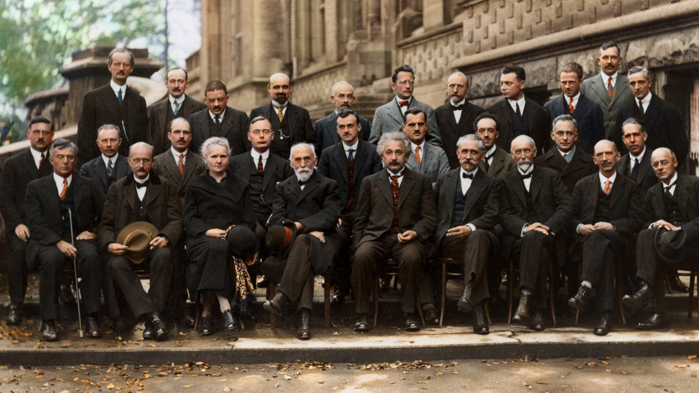

---
---

<!-- -->
<!-- -->
<link href="//netdna.bootstrapcdn.com/bootstrap/3.0.0/css/bootstrap-glyphicons.css" rel="stylesheet">
<!-- Carousel ================================================== -->

<!-- Indicators -->
  <ol class="carousel-indicators">
    <li data-target="#myCarousel" data-slide-to="0" class="active"></li>
    <li data-target="#myCarousel" data-slide-to="1"></li>
    <li data-target="#myCarousel" data-slide-to="2"></li>
    <li data-target="#myCarousel" data-slide-to="3"></li>
  </ol>

  

    

      <a href="https://cusco-cientifico.github.io/events/">
    <!--https://www.brisbanekids.com.au/awesome-guide-brisbane-kids-love-astronomy-/-->
    <!---->
        
      </a>
    

    

    <!---->
      
    

    

    <!---->
      
    

    

    <!---->
      
    

  

  <a class="left carousel-control" href="#myCarousel" data-slide="prev">
    
    Previous
  </a>
  <a class="right carousel-control" href="#myCarousel" data-slide="next">
    
    Next
  </a>

 <!-- /.carousel -->

## **Presentación**

 <b>“Cusco Científico”</b>, es un grupo de egresados de la <a href="http://fi.unsaac.edu.pe/home/"> Escuela Profesional de Física</a> de la <a href="http://www.unsaac.edu.pe/">Universidad Nacional de San Antonio Abad del Cusco (UNSAAC)</a>. Los integrantes, que actualmente vienen desarrollando sus proyectos de investigación en diferentes áreas de la Física, comparten el fin común de promover la investigación científica en nuestra región. 

Puesto que la mayoria de los miembros se encuentran trabajando en diferentes instituciones del Perú y el extranjero, son llevadas reuniones remotas periódicas a lo largo del año para la toma de decisiones y discusión de asuntos académicos a partir de octubre del 2018. 
<!--Dichas reuniones se llevan a cabo de manera remota debido a que los miembros se encuentran trabajando en diferentes instituciones del Perú y el extranjero.-->

 

## **Objetivos del grupo**

<ol>
<li>
Intercambiar y/o compartir información, experiencias académicas y temas afines entre los miembros integrantes del grupo.
</li>
<li>
Desarrollar proyectos de investigación y promover la colaboración entre los miembros del grupo.
</li>
<li>
Incentivar y fomentar un vínculo de colaboración entre estudiantes, docentes y exalumnos de Física de la UNSAAC, teniendo como fin común la investigación científica.
  </li>
<li>
Realizar divulgación científica a través de eventos, redes sociales y medios de comunicación.
 </li>
</ol>
<!--The **R** **E**pidemics **Con**sortium (RECON) is an international
not-for-profit, **non-governmental organisation** gathering experts in data
science, modelling methodology, public health, and software development to
create the next generation of analytics tools for informing the response
to *disease outbreaks*, *health emergencies* and *humanitarian crises*, 
using the [R software](https://www.r-project.org/) and other free, 
open-source resources.

This includes packages specifically designed for handling, visualising, and
analysing outbreak data using cutting-edge statistical methods, as well as more
general-purpose tools for data cleaning, versioning, and encryption, and system
infrastructure.

Our packages must fulfil three key aspects:

- *Efficiency*: our tools can be used in real time to improve situation
  awareness and inform intervention strategies.

- *Reliability*: our tools are thoroughly and constantly tested using
  professional software development methods.

- *Accessibility*: our tools are free, open-source, and available on virtually
  any platform; they can be used with different levels of expertise, and aim to
  provide graphical user interfaces implementing the most important
  functionalities.

Besides its active involvement in the creation of tools, RECON is also
increasingly dedicated to:

- *disseminating knowledge*: RECON provides free, open-access training material
   on its training platform [reconlearn.org](https://reconlearn.org), and
   regularly organises workshops and short courses on outbreak analytics and
   data science. Our [public forum ](/forum), freely accessible to anyone, is
   dedicated to sharing exptertise on these topics.

- *outbreak response deployment*: RECON supports the deployment of data
   analytics resources to the field as part of the response to health
   emergencies; this includes the deployment of staff as well as analysis
   systems adapted to low resources settings.

  As of 19th September 2018, RECON is registered as a *not-for-profit*,
*incorporated association* regulated by the French law (registration number
W751246083), in accordance to the association law of 1st July 1901 and the
decree of the 16th August 1901. For more information about the remit of RECON,
check our official statutes in [English](documents/statutes_en_1.1.pdf) or in
[French](documents/statutes_fr_1.1.pdf).-->
